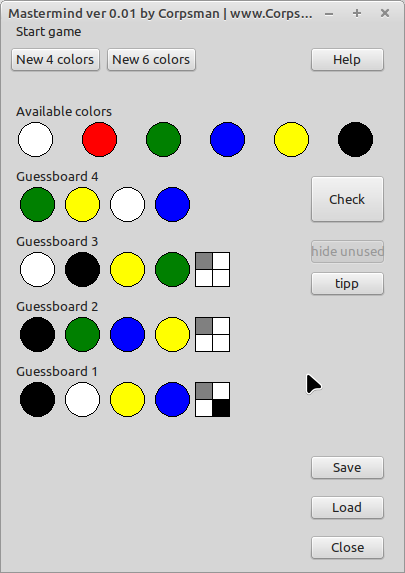
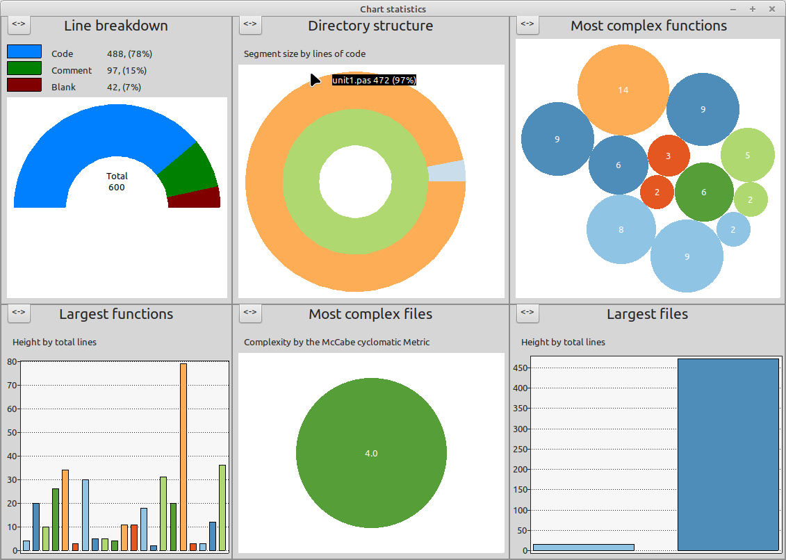
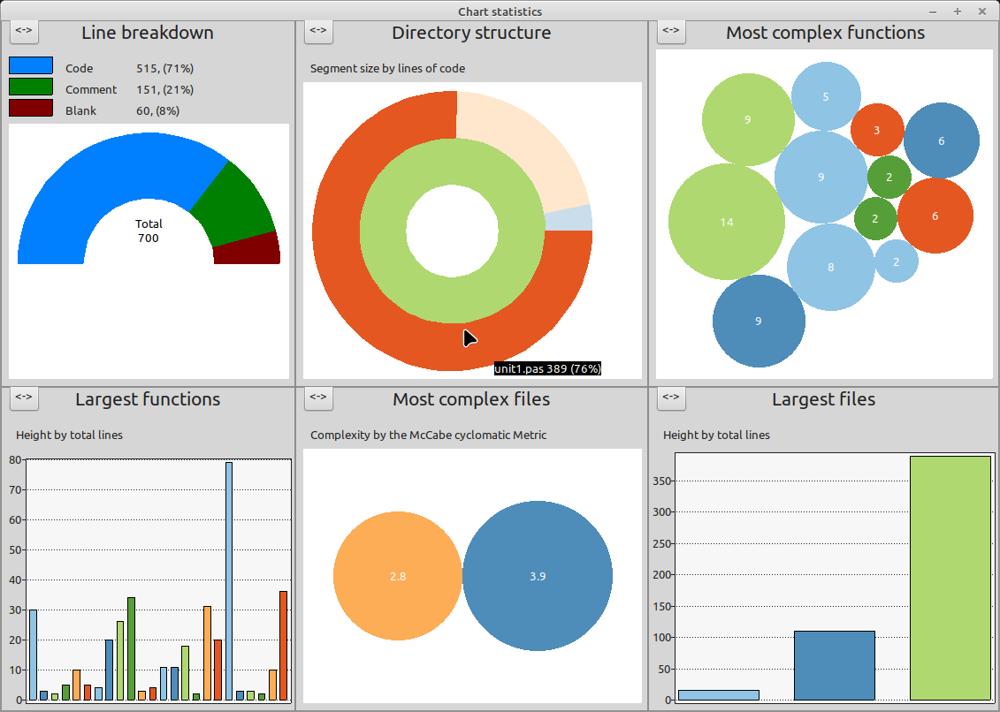

# Mastermind

This repository implements the Mastermind board game with 4 or 6 colors (including an AI that can be used to get tipps, when solving).

This repository holds a playable game and if you want. Download, compile and play the game. But that is not the reason why i created this repository ;).

I created this repository as i needed a "old" starting point of a working project where i could practice and improve my refactoring skills.

This repository will "log" by its commits the progress of hopefully improving the code base step by step. This will give you the ability to see how i improved the code.

As starting point i read the book "Five Lines of Code" (ISBN-10: 3836292246, ISBN-13: 978-3836292245) written by Christian Clausen. I will practice the technices shown in this book and mix them with my intuition to hopefully in the end, get a cristal clear easy to read codebase that is still working like expected.

This is the FPC_understand chart statistic of the inital commit:

This is the FPC_understand chart statistic of on 10.09.2023:

## License

See the license.md file located at https://github.com/PascalCorpsman/Software_Licenses/blob/main/license.md for details about the license.